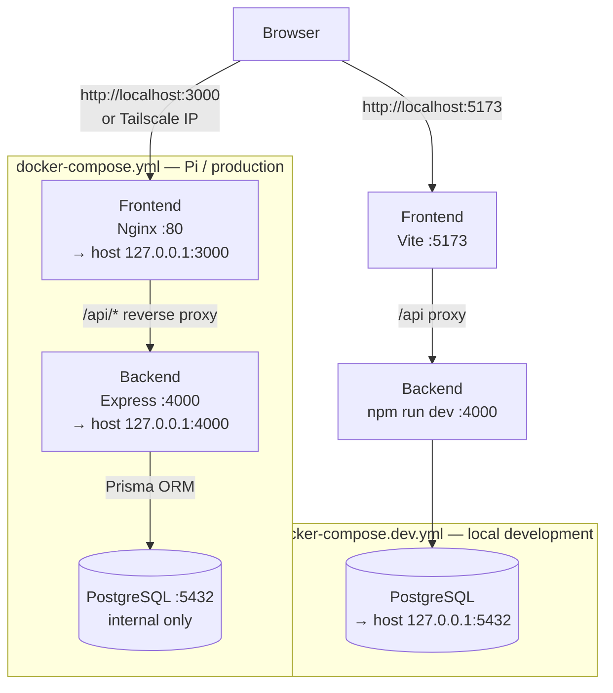

# Atlased

A self-hosted web app with an interactive 3D globe for tracking visited countries and cities. Built for deployment on a Raspberry Pi home server alongside Pi-hole and Tailscale.

> **Status:** Phase 1 — Scaffolding complete. Full docs added in Phase 8.

---

## Architecture



---

## Port Allocation

| Service         | Host Port | Container Port | Notes                              |
|-----------------|-----------|----------------|------------------------------------|
| Frontend (prod) | 3000      | 80 (Nginx)     | Bind: `127.0.0.1` only             |
| Backend API     | 4000      | 4000           | Bind: `127.0.0.1` only             |
| PostgreSQL (dev)| 5432      | 5432           | Dev only — not exposed in prod     |
| Frontend (dev)  | 5173      | —              | Vite dev server, native            |

**Pi-hole** uses ports 53, 80, 443. **Tailscale** uses 41641/UDP. No conflicts.

---

## Quick Start — Local Development

### Prerequisites
- Node.js ≥ 20
- npm ≥ 10

### Setup Option A: SQLite (No Docker required) — Recommended for quick testing

Fastest way to get running — uses a local SQLite file, no database server needed.

```bash
git clone <repo-url>
cd travel-map

# Backend setup (runs dev.ps1 or dev.bat which auto-configures environment)
cd backend
./dev.ps1          # PowerShell
# or: dev.bat       # Command Prompt
# or: npm run dev   # After manually setting env vars

# In a new terminal, frontend setup
cd frontend
npm install
npm run dev
```

Open [http://localhost:5173](http://localhost:5173) to test the app.

**Database file location:** `backend/atlased-dev.db` (created automatically on first run)

To seed the database with countries and cities:
```bash
cd backend
npm run db:seed
```

**Using environment files (.env.local or .env):**

The backend directory includes pre-configured environment files:
- `backend/.env.local` - for local development
- `backend/.env` - fallback option  

Both are pre-configured for SQLite. You can either:
1. Use the startup scripts (`dev.ps1` or `dev.bat`) — easiest
2. Manually set environment variables and run `npm run dev`
3. Rely on dotenv loading from `.env` or `.env.local`

---

### Setup Option B: PostgreSQL + Docker — Full production-like testing

If you want to test with PostgreSQL (same as production on the Pi):

```bash
# 1. Copy and configure environment
cp .env.example .env
# Edit .env — set POSTGRES_PASSWORD and other values

# 2. Start PostgreSQL
docker compose -f docker-compose.dev.yml up -d

# 3. Backend — PostgreSQL mode
cd backend
npm install
npx prisma migrate dev
npm run db:seed
npm run dev

# 4. Frontend (in new terminal)
cd frontend
npm install
npm run dev
```

Open [http://localhost:5173](http://localhost:5173).

To clean up when done:
```bash
docker compose -f docker-compose.dev.yml down -v  # removes database volume
```

---

## Full-Stack Integration Test (pre-Pi validation)

```bash
# From repo root — builds and runs everything in Docker
docker compose up --build

# Open http://localhost:3000
```

Run this at least once before deploying to the Pi to catch any container-level issues.

---

## Deploying to Raspberry Pi

> Full deployment guide added in Phase 8.

---

## Environment Variable Reference

| Variable          | Required | Default       | Description                                      |
|-------------------|----------|---------------|--------------------------------------------------|
| `DATABASE_PROVIDER` | ✓      | `postgresql`  | `sqlite` (local dev) or `postgresql` (production) |
| `DATABASE_URL`    | ✓        | —             | `file:./atlased-dev.db` (SQLite) or connection string (PostgreSQL) |
| `POSTGRES_DB`     | ✓*       | —             | Database name (PostgreSQL only)                  |
| `POSTGRES_USER`   | ✓*       | —             | Database user (PostgreSQL only)                  |
| `POSTGRES_PASSWORD` | ✓*     | —             | Database password — use a strong random value (PostgreSQL only) |
| `JWT_SECRET`      | ✓        | —             | Signing key — minimum 32 chars, random           |
| `JWT_EXPIRES_IN`  |          | `90d`         | Token lifetime                                   |
| `BCRYPT_ROUNDS`   |          | `12`          | bcrypt cost factor                               |
| `CORS_ORIGIN`     | ✓        | —             | Exact frontend origin — never `*`                |
| `FRONTEND_PORT`   |          | `3010`        | Host port for frontend container                 |
| `DB_PORT`         |          | `5432`        | Host port for DB (docker-compose.dev.yml only)   |
| `NODE_ENV`        |          | `development` | `development` or `production`                    |

*PostgreSQL variables only needed when using `docker-compose.dev.yml` or production deployment.

---

## Tech Stack

| Layer      | Technology                           |
|------------|--------------------------------------|
| Frontend   | React 18, TypeScript, Vite           |
| Globe      | react-globe.gl (Three.js)            |
| Backend    | Node.js, Express, TypeScript         |
| ORM        | Prisma                               |
| Database   | SQLite (dev) / PostgreSQL 16 (prod)  |
| Auth       | JWT (httpOnly cookies) + bcryptjs    |
| Containers | Docker, Docker Compose               |
| Proxy      | Nginx (production frontend)          |
